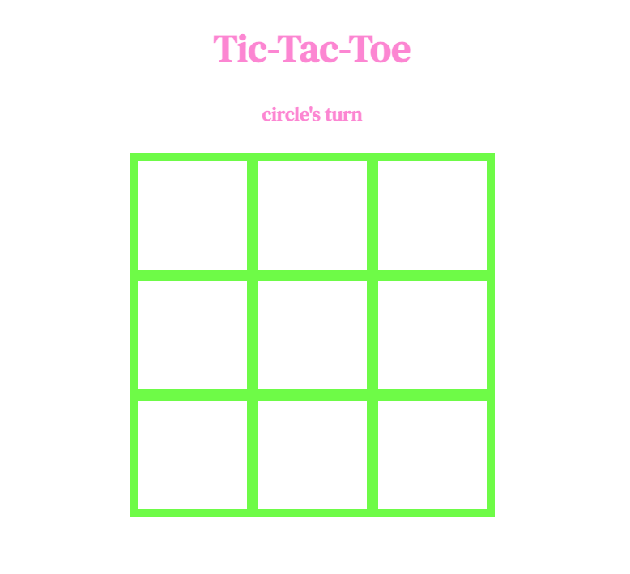
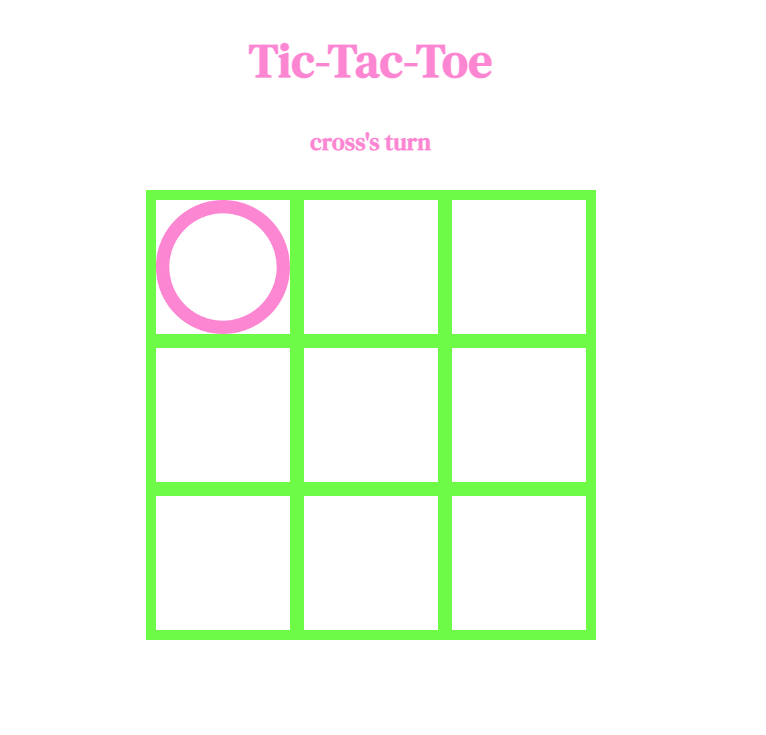
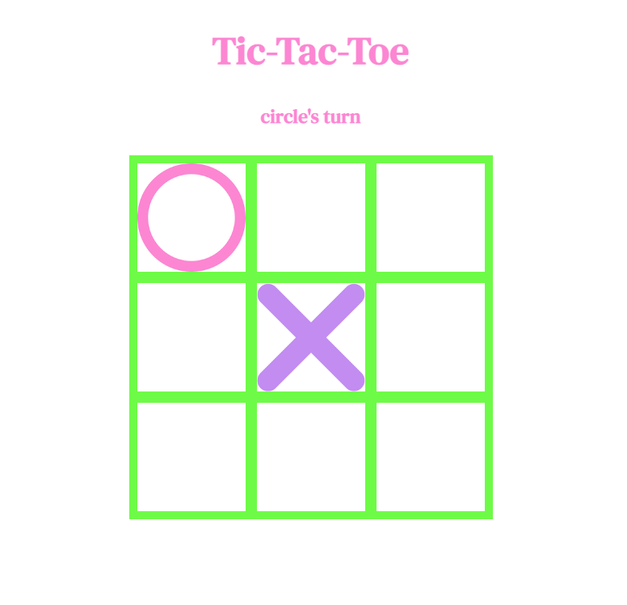
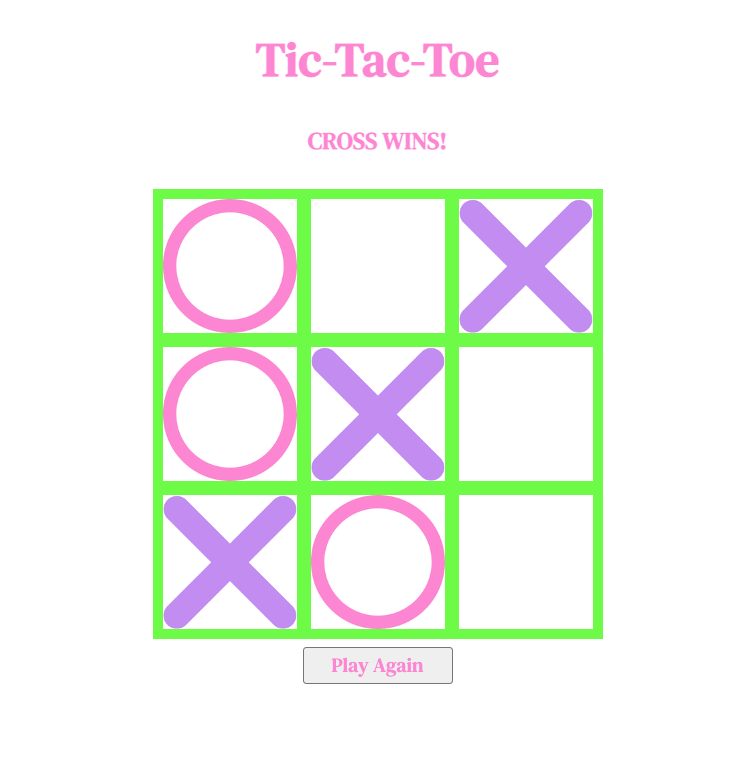
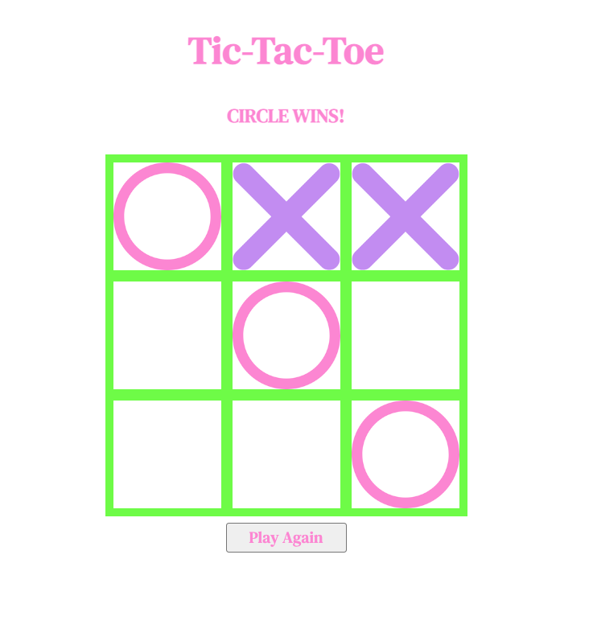
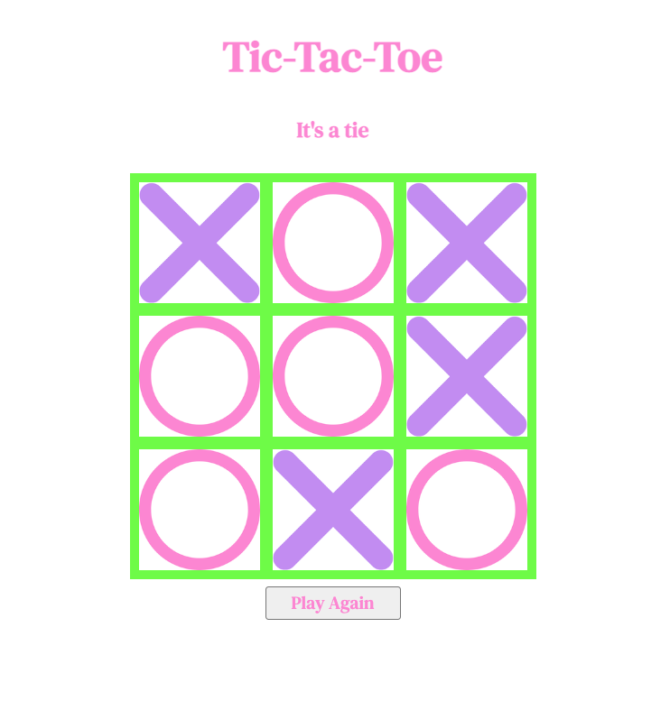

# TIC-TAC-TOE

A simple two-player game to score three in a row on a 3X3 board.

## Description and game play
Game play consists of two players taking turns to put their symbol - either a circle, or a cross, on a 3X3 grid,  trying to score three of the same symbols in a row either horizontally, vertically, or diagonally.
The first to do so is the winner.

## Screenshots of game play

## Technologies used
This game was guilt using HTML, CSS, and JavaScript

## Getting started

In this version of my game, circle will always take the first play.
[You can play it here](https://canvas-tcg.github.io/tac-tac-toe/).

## Next steps

Features I'd like to add would inlcude allowing the players to choose who goes first, and allowing them to choose the shapes they play with from a pre-defined list.